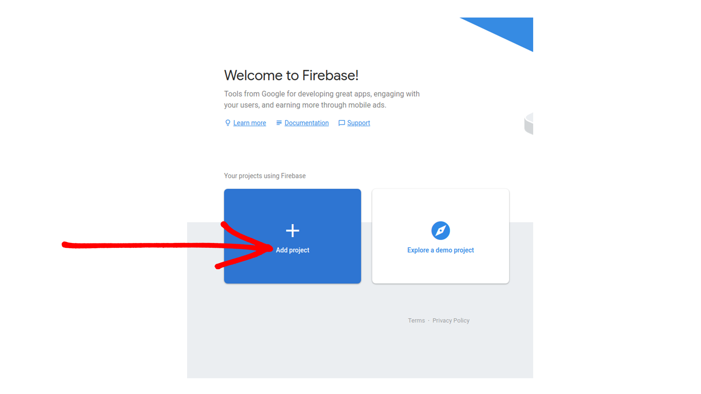
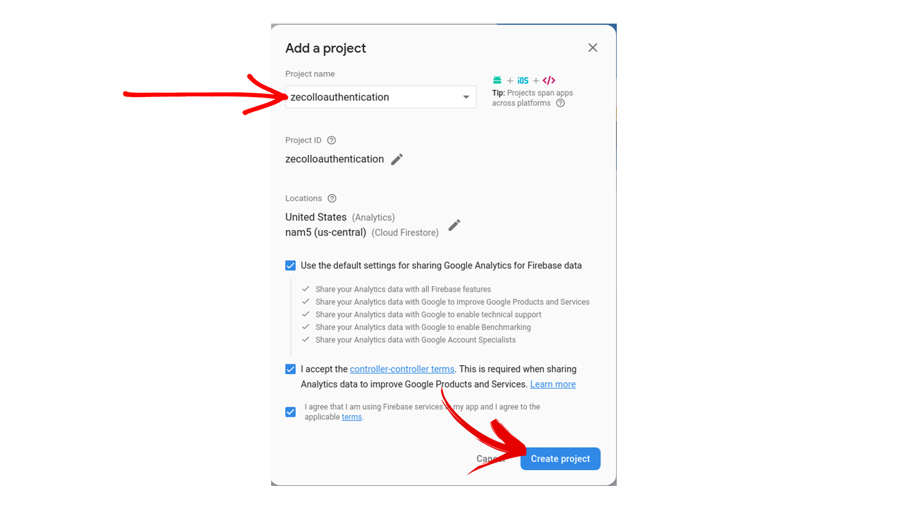
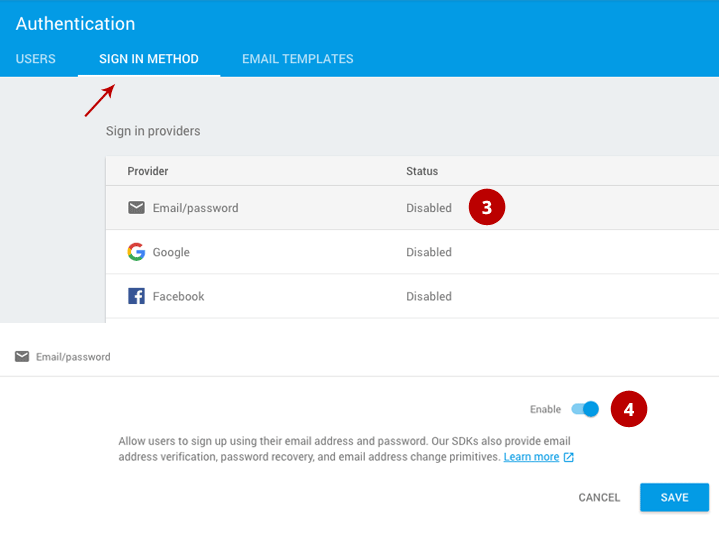
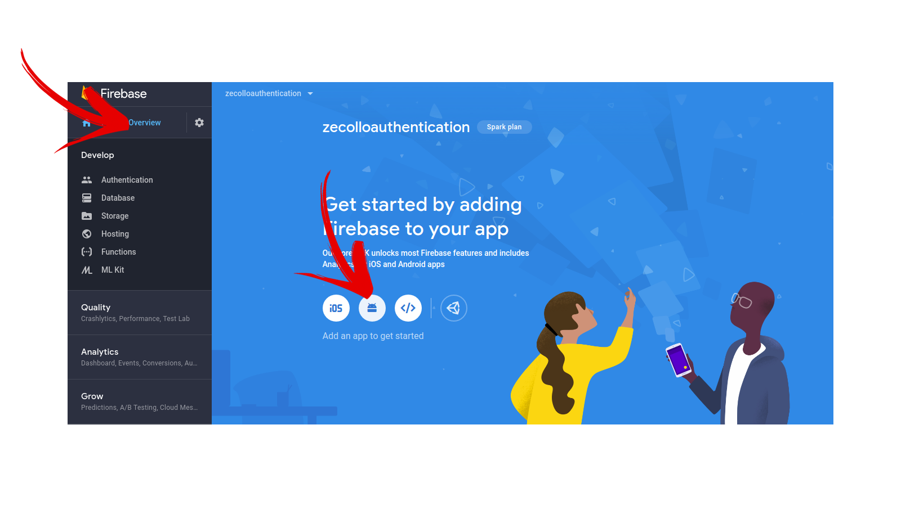
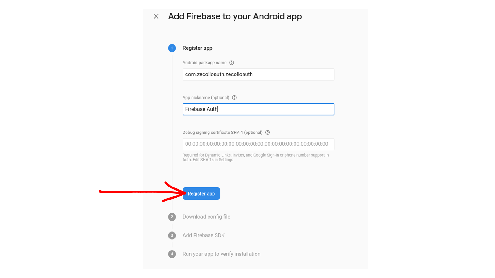
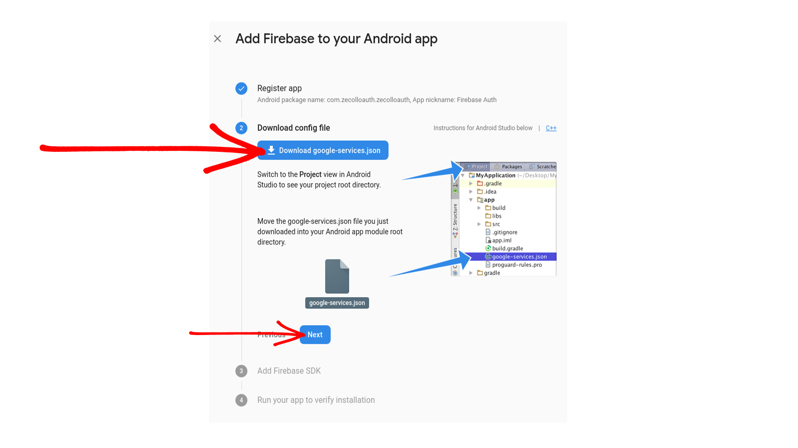
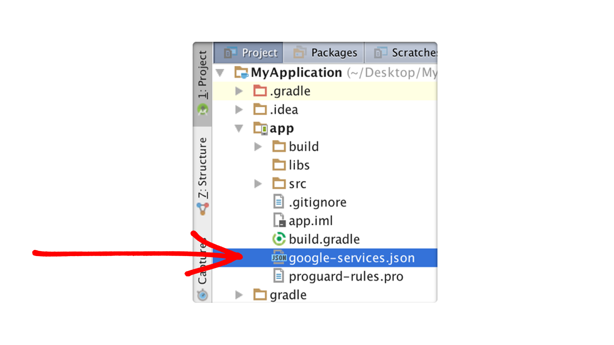

# Simple_SignIn_SignUp_Firebase
## Demo   
>  For Live Demo [Click Here](https://github.com/Varshithvhegde/Simple_SignIn_SignUp_Firebase/raw/master/app/release/app-debug.apk)
## Connecting to Firebase 
### Step 1
Go to [Firebase console](https://console.firebase.google.com/u/0/) Create an account   

### Step 2  
Select on "Add Project"   

### Step 3
Give any Project name as your wish and the select "Continue" and the also select "Continue" again

 

### Step 4
Select "Default Account" from the drop down and the select "Create Project" Just wait for few seconds until your project is built
 
### Step 5
Select Android as shown in the below image     

 

### Step 6
Register your app  
- Get your package name from android studio and add in the first text input box
- Add SHA1 certificate from android stdio (To know how to get the Debug signing certificate please refer [this](https://stackoverflow.com/questions/27609442/how-to-get-the-sha-1-fingerprint-certificate-in-android-studio-for-debug-mode))

#### To checkout this on a blog use this [Link](https://medium.com/@collo.kariss/firebase-authentication-f8706dd82be4) for a much clearer view. :point_right: [Click here :smile:](https://medium.com/@collo.kariss/firebase-authentication-f8706dd82be4)

### Step 7
First thing you need to do is go to `https://firebase.google.com/` and make an account to gain access to their console. After you gain access to the console you can start by creating your first project.

- **Give your project a name of your choice.**

### Step 8
Next go to your project dashboard. Find the Auth and click get started. Go to set up sign in method and choose Email & Password and enable it.

### Step 9
We need to now **add Firebase to our android app** so go to the project overview section and choose android.

### Step 10
Give the package name of your project (mine is com.zecolloauth.zecolloauth) in which you are going to integrate the Firebase. 

### Step 11
Here the google-services.json file will be downloaded.

### Step 12
Switch to the Project view in Android Studio to see your project root directory. Move the **google-services.json** file you just downloaded into your Android app module `app/src/main` root directory.

  

